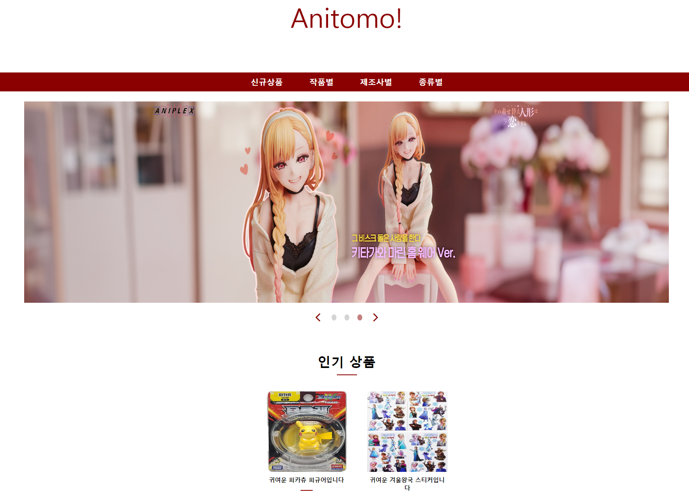
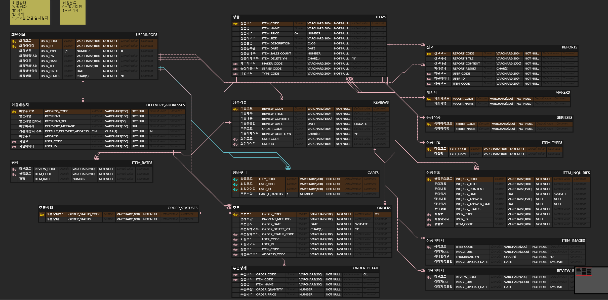

### 피규어샵 애니토모
***

- 링크 : http://54.180.103.70:8080/anitomo/
  - 테스트용 어드민 계정
  - ID : admin123
  - PW : admin123!

- 프로젝트 기간 : 24.03.15 ~ 24.04.10&nbsp;&nbsp;&nbsp;(일부 미구현 기능 존재)

- 프로젝트 인원 : 1명 (본인)

- 주요기능 
  - 회원가입 및 로그인
  - 상품조회 및 검색, 정렬
  - 상품 장바구니 추가 및 삭제, 주문하기
  - 회원 배송지 추가, 수정, 삭제
  - 상품 문의 및 리뷰 작성
  - 상품 등록, 수정, 삭제 (어드민)

- 언어 및 프레임워크
  - jdk 1.8
  - spring
  - jquery 3.7.1
  

- 빌드 툴 및 라이브러리, api
  - maven
  - toaster message library
  - ckeditor api
  - lombok
  - 카카오 주소 api

- DB
  - 오라클 11g
  - mybatis

- erd
  - 링크 : https://www.erdcloud.com/d/CrWfbRqJfvov9SyWF
    
  